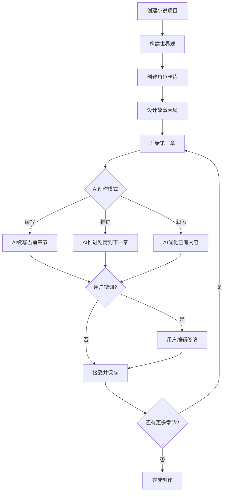

# AI小说创作工具 - 产品需求文档

## 1. 产品概述

**项目名称**: NovelForge - AI小说创作引擎

**项目简介**: 一款由AI驱动的沉浸式小说创作工具，用户设定世界观、角色和剧情框架后，AI将自动生成完整小说章节。角色会根据剧情发展动态进化，用户可随时微调干预。

**核心价值**:
- 让AI成为小说创作者，用户成为导演和编辑
- 角色拥有"成长记忆"，性格会随剧情演变
- 章节驱动型叙事，确保故事连贯性
- 支持多AI服务商接入（DeepSeek/Gemini等）

## 2. 功能范围

### 2.1 核心功能模块

| 模块 | 功能描述 |
|------|---------|
| **世界观构建** | 创建故事背景、时代设定、地理环境、社会规则等 |
| **角色系统** | 创建主角/配角角色卡，AI根据剧情发展自动更新角色性格和关系 |
| **故事大纲** | 创建整体故事框架、主线/支线剧情节点 |
| **章节管理** | 章节列表、章节内容编辑、AI续写、章节状态追踪 |
| **AI写作引擎** | 智能续写、润色、情节推进、氛围渲染 |
| **阅读器** | 沉浸式小说阅读界面，支持多种主题 |

### 2.2 主要页面

1. **仪表盘** - 项目总览、快速开始新项目、最近项目列表
2. **创作工作室** - 核心写作界面，包含：
   - 左侧：角色卡片列表和详情面板
   - 中间：章节内容编辑器/阅读器
   - 右侧：AI控制面板（续写/润色/生成选项）
3. **世界观编辑器** - 全局世界观设定、地理/历史/社会规则
4. **角色中心** - 所有角色卡片管理、性格发展时间线
5. **大纲视图** - 故事结构可视化、主支线剧情管理

## 3. 用户流程

### 3.1 创建新小说流程

```
创建项目 → 设定世界观 → 创建角色 → 构建大纲 → 启动AI创作
```

### 3.2 AI创作流程

```
选择章节 → 设置创作参数 → 触发AI生成 → 查看生成结果 → 微调/接受 → 下一章节
```

### 3.3 流程图



## 4. 角色进化系统

### 4.1 角色属性（AI自动更新）

| 属性 | 描述 |
|------|------|
| 性格标签 | 内向/外向/勇敢/懦弱等（可多选） |
| 关系网络 | 与其他角色的亲密度/敌对度 |
| 成长经历 | 参与的关键事件列表 |
| 当前状态 | 情绪、心理状态 |

### 4.2 角色进化规则

- 每完成一个重要剧情节点，AI评估角色性格变化
- 用户可在角色详情页手动调整AI生成的性格演变
- 角色关系会随互动事件动态更新

## 5. AI服务集成

### 5.1 支持的AI服务商

| 服务商 | 状态 | 用途 |
|--------|------|------|
| DeepSeek | 主要 | 文本生成、续写、润色 |
| Gemini | 备选 | 辅助生成 |
| 小米mimo | 待接入 | 扩展能力 |

### 5.2 AI创作模式

- **续写模式**: 在当前光标位置继续创作
- **推进模式**: 根据已有剧情，自动生成下一章节
- **润色模式**: 优化已有段落文笔
- **氛围模式**: 生成特定风格的场景描写

## 6. 界面设计

### 6.1 设计风格

- **主题**: 深色沉浸式 + 墨水纸质感
- **色调**: 深靛蓝背景 `#0f172a`，琥珀金强调色 `#f59e0b`，米白文字 `#e2e8f0`
- **字体**:
  - 标题: Noto Serif SC（衬线体，文学感）
  - 正文: LXGW WenKai（优雅易读）
- **布局**: 三栏式创作工作室，左侧角色/右侧控制/中间内容

### 6.2 页面概览

| 页面 | 主要元素 |
|------|---------|
| 仪表盘 | 项目卡片网格、快速开始按钮、最近创作记录 |
| 创作工作室 | 三栏布局：角色栏/编辑区/AI控制面板 |
| 世界观编辑器 | 卡片式信息模块，可折叠分类 |
| 角色中心 | 角色头像网格+详情侧边栏 |
| 阅读器 | 全屏沉浸式，护眼主题 |

### 6.3 响应式策略

- 桌面优先设计
- 平板：收起左侧栏，浮动显示角色面板
- 移动端：底部Tab导航，主要功能可及

## 7. 技术选型

| 类别 | 选型 |
|------|------|
| 前端框架 | React 18 + TypeScript |
| 构建工具 | Vite |
| 样式方案 | TailwindCSS |
| 状态管理 | Zustand |
| AI调用 | OpenAI兼容格式（支持DeepSeek/Gemini） |
| 本地存储 | IndexedDB（小说数据持久化） |

## 8. 数据结构

### 8.1 核心数据模型

- **Project**: 小说项目（标题、描述、创建时间）
- **WorldSetting**: 世界观设定
- **Character**: 角色卡片（性格、关系、成长历史）
- **Chapter**: 章节（标题、内容、状态）
- **Outline**: 大纲节点（主线/支线、状态）
