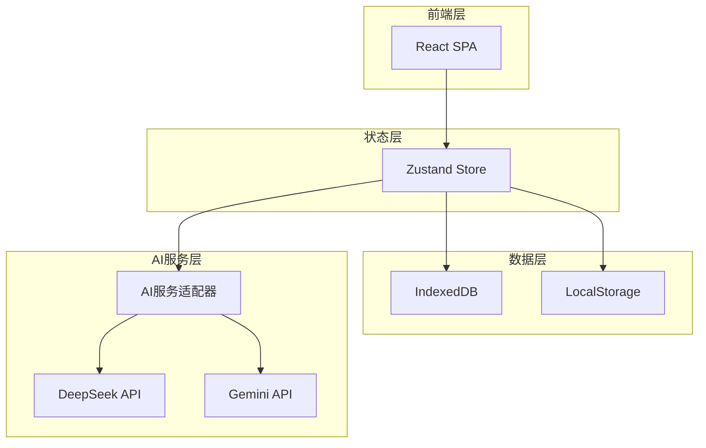
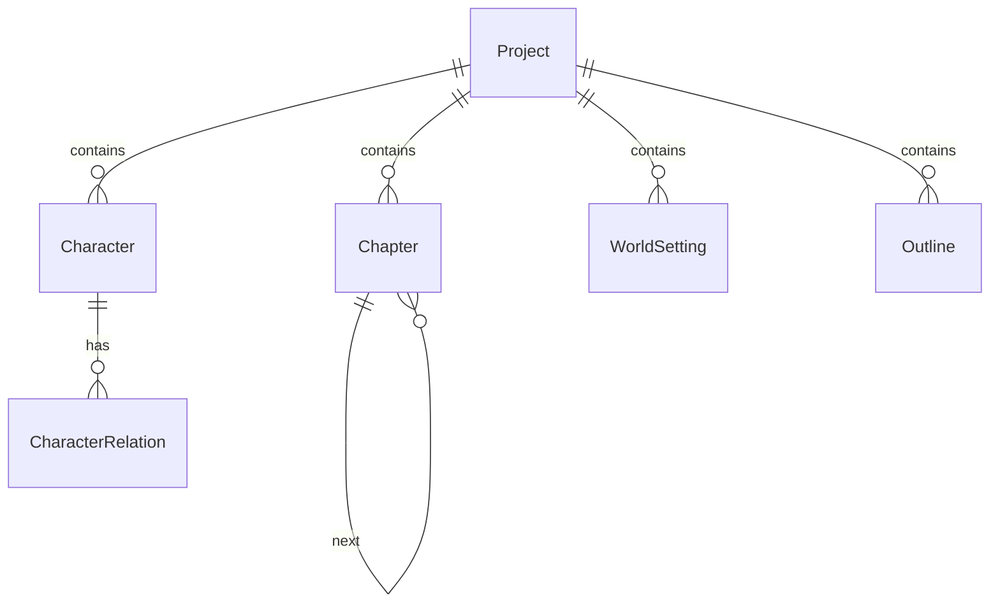

# NovelForge - 技术架构文档

## 1. 架构设计



## 2. 技术栈

| 类别 | 技术 | 版本 |
|------|------|------|
| 框架 | React | 18.x |
| 语言 | TypeScript | 5.x |
| 构建 | Vite | 5.x |
| 样式 | TailwindCSS | 3.x |
| 状态 | Zustand | 4.x |
| 路由 | React Router | 6.x |
| AI格式 | OpenAI兼容 | - |

## 3. 路由定义

| 路由 | 页面 | 描述 |
|------|------|------|
| `/` | Dashboard | 首页仪表盘 |
| `/studio/:projectId` | Studio | 创作工作室 |
| `/world/:projectId` | WorldEditor | 世界观编辑 |
| `/characters/:projectId` | CharacterCenter | 角色中心 |
| `/outline/:projectId` | OutlineView | 大纲视图 |
| `/reader/:projectId/:chapterId` | Reader | 阅读器 |
| `/settings` | Settings | 设置页 |

## 4. 组件结构

```
src/
├── components/
│   ├── layout/
│   │   ├── Sidebar.tsx
│   │   ├── Header.tsx
│   │   └── ThreeColumnLayout.tsx
│   ├── studio/
│   │   ├── ChapterEditor.tsx
│   │   ├── CharacterPanel.tsx
│   │   ├── AIControlPanel.tsx
│   │   └── AIPromptModal.tsx
│   ├── character/
│   │   ├── CharacterCard.tsx
│   │   ├── CharacterDetail.tsx
│   │   └── CharacterEvolve.tsx
│   ├── world/
│   │   ├── WorldSettingCard.tsx
│   │   └── WorldEditor.tsx
│   ├── outline/
│   │   ├── OutlineTree.tsx
│   │   └── ChapterNode.tsx
│   └── reader/
│       ├── ReaderContent.tsx
│       └── ReaderControls.tsx
├── pages/
│   ├── Dashboard.tsx
│   ├── Studio.tsx
│   ├── WorldEditor.tsx
│   ├── CharacterCenter.tsx
│   ├── OutlineView.tsx
│   ├── Reader.tsx
│   └── Settings.tsx
├── stores/
│   ├── projectStore.ts
│   ├── characterStore.ts
│   ├── chapterStore.ts
│   └── aiStore.ts
├── services/
│   ├── ai/
│   │   ├── adapter.ts
│   │   ├── deepseek.ts
│   │   └── gemini.ts
│   └── db/
│       └── indexedDB.ts
├── types/
│   └── index.ts
└── App.tsx
```

## 5. 数据模型

### 5.1 实体关系



### 5.2 TypeScript类型定义

```typescript
interface Project {
  id: string;
  title: string;
  description: string;
  createdAt: number;
  updatedAt: number;
}

interface WorldSetting {
  id: string;
  projectId: string;
  era: string;
  location: string;
  societyRules: string;
  customRules: string[];
}

interface Character {
  id: string;
  projectId: string;
  name: string;
  role: 'protagonist' | 'supporting' | 'minor';
  avatar?: string;
  personality: PersonalityTag[];
  relationships: CharacterRelation[];
  growthLog: GrowthEvent[];
  currentState: string;
}

interface PersonalityTag {
  tag: string;
  weight: number; // 0-1
  evolvedAt?: number;
}

interface CharacterRelation {
  targetId: string;
  type: 'friend' | 'enemy' | 'neutral' | 'romantic';
  intimacy: number; // -100 to 100
}

interface GrowthEvent {
  chapterId: string;
  description: string;
  personalityChanges: Partial<PersonalityTag>[];
  timestamp: number;
}

interface Chapter {
  id: string;
  projectId: string;
  number: number;
  title: string;
  content: string;
  status: 'draft' | 'ai_generated' | 'revised' | 'completed';
  createdAt: number;
  updatedAt: number;
}

interface Outline {
  id: string;
  projectId: string;
  title: string;
  type: 'main' | 'sub';
  parentId?: string;
  status: 'pending' | 'in_progress' | 'completed';
  description: string;
}
```

## 6. AI服务适配器

### 6.1 统一接口

```typescript
interface AIServiceAdapter {
  name: string;
  generate(prompt: string, options?: GenOptions): Promise<string>;
  continueWrite(context: WriteContext): Promise<string>;
  polish(content: string, style?: string): Promise<string>;
  generateScene(atmosphere: string): Promise<string>;
}
```

### 6.2 支持的服务

- **DeepSeek**: 主用服务，OpenAI兼容格式
- **Gemini**: 备用服务，Google AI格式

## 7. 状态管理 (Zustand)

| Store | 职责 |
|-------|------|
| projectStore | 项目CRUD、当前项目 |
| characterStore | 角色管理、性格进化 |
| chapterStore | 章节管理、AI生成状态 |
| aiStore | AI配置、API密钥管理 |
| uiStore | 界面状态（侧栏展开等） |

## 8. 本地存储

- **IndexedDB**: 小说内容、章节、角色等核心数据
- **LocalStorage**: 用户设置、UI偏好、AI API密钥
